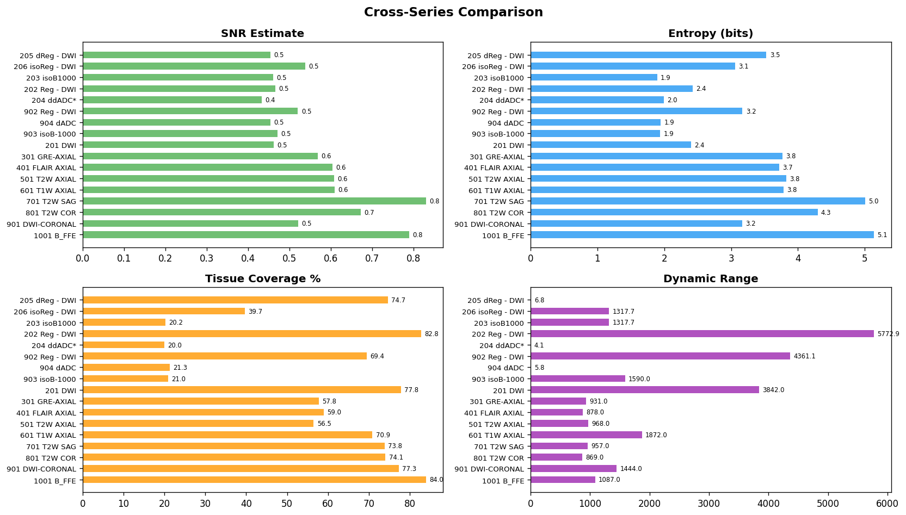

# Speall MRI Brain Dataset

**Repository:** [`shubhxho/speall-mri`](https://huggingface.co/datasets/shubhxho/speall-mri)
**License:** MIT
**Modality:** MRI (Magnetic Resonance Imaging)
**Body Region:** Brain + Cerebrovascular

---

## Overview

A clinical brain MRI collection of **1,105 patient studies** containing **355,133 DICOM files** (~66 GB raw, **34,574 series**) acquired between **December 2021 and October 2024**. The corpus is dominated by a GE SIGNA Pioneer 3.0T protocol but also includes paired Philips Achieva 1.5T, Siemens MAGNETOM, and additional GE platforms — providing a realistic multi-vendor, multi-field-strength sample of routine neuroradiology practice.

Each study delivers a multi-sequence brain protocol (typically 14 to 30+ series) spanning diffusion, perfusion, structural, vascular, and susceptibility imaging. Every series is enriched with full DICOM tag extraction, volumetric statistics, automated quality grading, multiplane montages, intensity histograms, contrast-enhanced views, and a composite ML training score.

---

## Source & Provenance

| Field | Value |
|---|---|
| **Acquisition Period** | December 2021 – October 2024 (450 distinct study dates) |
| **Geography** | India (single hospital network; institution names redacted) |
| **Studies** | 1,105 |
| **Series** | 34,574 |
| **DICOM Files** | 355,133 |
| **Raw Volume** | ~66 GB |
| **Patient Sex** | M 51.6% / F 48.3% |
| **DICOM Tags Extracted** | 240+ columns per file (incl. vendor-private tags) |

### Scanner mix (by file count)

| Vendor | Model | Field | Files | Share |
|---|---|---|---:|---:|
| GE | SIGNA Pioneer | 3.0T | 262,192 | 73.8% |
| Philips | Achieva | 1.5T | 38,713 | 10.9% |
| GE | SIGNA Explorer | 1.5T | 20,161 | 5.7% |
| GE | Signa HDxt | 1.5T | 9,154 | 2.6% |
| GE | SIGNA Creator | 1.5T | 8,378 | 2.4% |
| Siemens | MAGNETOM Essenza | 1.5T | 5,504 | 1.6% |
| GE | Optima MR360 | 1.5T | 4,804 | 1.4% |
| Philips | Achieva dStream | 1.5T | 2,588 | 0.7% |
| Philips | Spectra | 1.5T | 2,010 | 0.6% |
| Philips | Ingenia CX | 3.0T | 983 | 0.3% |
| Toshiba | FILMER 6.0 / MRT200SP3 | 1.5T | 619 | 0.2% |

**Aggregate:** GE 86%, Philips 12%, Siemens 2%, Toshiba <1% — 3.0T 80%, 1.5T 20%.

### Primary protocol (the SIGNA Pioneer subset)

| Field | Value |
|---|---|
| Scanner | GE SIGNA Pioneer 3.0T |
| Software | `PX26.1_R03_2128.b` (most common) |
| RF Coil | Head 32-channel |
| Study description | BRAIN, BRAIN P+C, BRAIN ANGIO, BRAIN CE, BRAIN EPILEPSY, etc. |

---

## Top Sequences (by series count)

| # | Sequence | Series | Description |
|---:|---|---:|---|
| 1 | Ax DSC Perfusion | 47,593 | Dynamic susceptibility contrast |
| 2 | 3D Ax SWAN (+ FILT_PHA) | 42,974 | Susceptibility-weighted angiography |
| 3 | 3D Ax T1 SPGR FS | 11,296 | 3D T1 fat-suppressed |
| 4 | 3D SAG T1 SPGR FS | 10,756 | 3D sagittal T1 fat-suppressed |
| 5 | Ax DWI | 9,217 | Diffusion-Weighted Imaging |
| 6 | Ax T2 FLAIR | 6,912 | Fluid-Attenuated Inversion Recovery |
| 7 | Ax T2 PROPELLER | 5,603 | T2 with motion correction |
| 8 | 3D Sag T1 BRAVO | 4,484 | 3D sagittal T1 |
| 9 | 3D Ax T2 Cube HyperCube | 4,460 | 3D isotropic T2 |
| 10 | 3D Ax TOF NECK | 4,236 | Neck angiography |
| 11 | BRAIN ANGIO | 3,814 | MR Angiography (TOF) |
| 12 | ADC (10⁻⁶ mm²/s) | 3,621 | ADC map |
| 13 | AxT1 MEMP | 3,152 | T1 Multi-Echo Multi-Phase |
| 14 | Ax DWI ALL B-1000 | 3,126 | Diffusion isotropic |
| 15 | 3D Sag T2 Cube | 3,068 | 3D isotropic T2 |
| + | eADC, 3D Sag MRV, NECK ANGIO, COR T2 FSE, DTI 27-direction tensor, B-FFE / CISS, GRE, T2W AXIAL, T1W AXIAL, vendor-derived processed maps (Reg-DWI, isoB1000, dADC, MIP / projection) | | |

**Typical study:** 14–30+ series including derived/post-processed maps.

---

## Dataset Structure

```
speall_mri/
  {study_id}/
    {sequence_subdir}/
      s{NNNN}_{description}/
        s{NNNN}_{description}_detail.json    # Full extraction metadata
        s{NNNN}_{description}_multiplane.png # Axial + coronal + sagittal montage
        s{NNNN}_{description}_histogram.png  # Intensity distribution
        s{NNNN}_{description}_enhanced.png   # Contrast-enhanced view
        s{NNNN}_{description}.mcap           # MCAP container (series + metadata)
    cross_series_comparison.png              # SNR/entropy/tissue/range chart
    dicom_study.mcap                         # Full study MCAP record
```

---

## Data Points Per Series

### DICOM Metadata (240+ tag columns)
Every standard and vendor-private DICOM tag extracted, including:
- Patient demographics (age, sex, weight)
- Scanner parameters (TR, TE, TI, FA, b-value, bandwidth, matrix, FOV)
- Geometry (spacing, orientation, slice thickness, position)
- Vendor-private tags: GE groups 0009, 0019, 0021, 0023, 0025, 0027, 0029, 0043, 0051; Philips and Siemens equivalents preserved where present.

### Volume Statistics
- Shape, spacing, origin, direction cosines, voxel volume
- Intensity: min, max, mean, std, median, percentiles (p1/p5/p25/p75/p95/p99), IQR
- Dynamic range, entropy, skewness, kurtosis
- SNR estimate, naive SNR, CNR
- Background noise std, Otsu threshold
- Tissue coverage %, nonzero coverage %
- Per-slice SNR (mean, std, min, max), intensity uniformity

### Quality Analysis
- **Quality grade** (A–F) with breakdown: SNR, CNR, uniformity, tissue coverage, dynamic range, entropy, nonzero coverage
- **Anomaly detection**: per-slice z-scores, anomalous slice identification
- **Symmetry analysis**: left-right symmetry index, asymmetry map
- **Sharpness analysis**: edge sharpness mean/std/p95
- **Motion analysis**: ghosting ratio, directional energy, adjacent slice correlation, severity score

### Advanced Quality Metrics
- **Contrast-to-noise ratio (CNR)**: Otsu-based tissue/background separation
- **Noise floor**: Rician noise model estimation from air regions
- **Bias field severity**: B1 inhomogeneity via local mean coefficient of variation
- **Edge sharpness**: Laplacian variance across multiple slices
- **Histogram separation**: tissue class peak analysis, segmentation difficulty
- **Inter-slice consistency**: adjacent slice correlation for 3D training suitability

### ML Training Score
- **Score**: 0–100 composite from CNR (25), noise (20), bias (15), sharpness (15), histogram (10), consistency (15)
- **Grade**: A/B/C/D/F (80–100 / 65–79 / 50–64 / 35–49 / <35)
- **Commercial tier**: premium / standard / usable / limited / exclude

---

## Visualizations

### Multiplane Montage (Axial + Coronal + Sagittal)

**Ax DWI (b=1000)**


**Ax T2 FLAIR**


**Ax T1 MEMP**


**Brain Angio (MRA)**


### Cross-Series Quality Comparison



*SNR, entropy, tissue coverage, and dynamic range across all sequences in a single study.*

---

## Sample JSON (per-series detail)

```json
{
  "series_number": 5,
  "series_description": "Ax DWI",
  "modality": "MR",
  "file_count": 50,
  "sequence_classification": {
    "sequence_type": "DWI",
    "confidence": "high",
    "reasoning": ["Name matches '\\bDWI\\b'", "b-value=1000.0 confirms diffusion"]
  },
  "sequence_params": {
    "tr": 6034.0, "te": 74.5, "fa": 90.0, "b_value": 1000.0
  },
  "volume_stats": {
    "volume_shape": [50, 256, 256],
    "spacing_mm": [1.094, 1.094, 2.939],
    "fov_mm": [146.9, 280.0, 280.0],
    "volume_snr_estimate": 1.90,
    "volume_cnr": 1769.0,
    "volume_entropy": 1.67,
    "volume_tissue_pct": 5.81
  },
  "quality_analysis": {
    "quality_grade": {"grade": "D", "score": 44.5,
      "breakdown": {"snr": 5.9, "cnr": 10.0, "uniformity": 3.8,
                    "tissue_coverage": 1.5, "dynamic_range": 12.0,
                    "entropy": 3.3, "nonzero_coverage": 8.0}},
    "anomaly_detection": {"n_anomalous": 0},
    "sharpness_analysis": {"interpretation": "very sharp"},
    "motion_analysis": {"motion_severity_score": 35.4}
  },
  "ml_training_score": {
    "score": 72.5, "grade": "B", "commercial_tier": "standard"
  }
}
```

---

## Processing Pipeline

```
Raw DICOM (66 GB, Samsung T7 Shield)
        |
        v
  [Modal Cloud — micom-data + micom-v2 Volumes]
        |
        +---> Stage 1: Redaction (97-rule HIPAA pipeline)
        |       - PHI scrubbing (patient names, IDs, institution)
        |       - Pre/post-scan validation
        |
        +---> Stage 2: Extraction (pydicom + SimpleITK)
        |       - Every DICOM tag (240+ columns)
        |       - Volume geometry + pixel statistics
        |       - Sequence classification
        |       - Quality grading (A–F)
        |       - Montages, histograms, enhanced views
        |
        +---> Stage 3: Advanced Quality (numpy + scipy)
        |       - CNR, noise floor, bias field
        |       - Edge sharpness, histogram separation
        |       - Inter-slice consistency
        |       - ML training score (0–100)
        |
        +---> Stage 4: Upload to HuggingFace
                - MCAP-packaged series + per-series JSON
```

**Infrastructure:** Modal serverless (auto-scaled CPU containers, persistent Volume v2)
**Throughput:** 1,105 studies × ~31 series avg = 34,574 series processed

---

## Use Cases

- **Brain segmentation** model training (gray/white matter, CSF, lesions)
- **Pathology detection** (stroke, hemorrhage, tumors, white matter disease, epilepsy)
- **Sequence classification** benchmarks across 30+ sequence types
- **Image quality assessment** algorithm development
- **Diffusion / Perfusion MRI** research (DWI, ADC, DSC perfusion)
- **MR Angiography / Venography** vascular analysis (TOF, MRV)
- **Cross-vendor robustness** studies (GE / Philips / Siemens distribution shift)
- **Cross-field-strength** generalization (3.0T ↔ 1.5T)
- **Indian population** neuroimaging reference data

---

## Formats Available

| Format | Description |
|---|---|
| `*_detail.json` | Per-series structured metadata + quality + stats |
| `*_multiplane.png` | 3-plane montage (axial, coronal, sagittal views) |
| `*_histogram.png` | Intensity distribution plot |
| `*_enhanced.png` | Contrast-enhanced visualization |
| `*.mcap` | MCAP container of the series + metadata |
| `dicom_metadata.csv` | Tabular per-file metadata (240+ columns) |
| `dicom_metadata.parquet` | Same as CSV in columnar format |
| `dicom_full_dump.json` | Complete DICOM tag dump (~4.2 GB) |
| `series_stats.json` | Aggregated series-level statistics |
| `cross_series_comparison.png` | Multi-metric comparison chart |
| `report.html` | Interactive HTML dashboard |

---

## Provenance

Numbers above are derived from a complete sweep of the T7 Shield DICOM corpus on 2026-04-30 (355,133 files, 0 read errors) and cross-checked against the modal pipeline output (`micom-data` and `micom-v2` volumes). PHI has been redacted; institution names are stripped from the source headers.

---

## Citation

```bibtex
@dataset{speall_mri_2026,
  title={Speall MRI Brain Dataset: 1,105 Multi-Vendor Clinical Brain MRI Studies},
  author={Shubh},
  year={2026},
  publisher={Hugging Face},
  url={https://huggingface.co/datasets/shubhxho/speall-mri},
  note={Acquired Dec 2021 -- Oct 2024 across GE, Philips, Siemens, Toshiba scanners}
}
```
